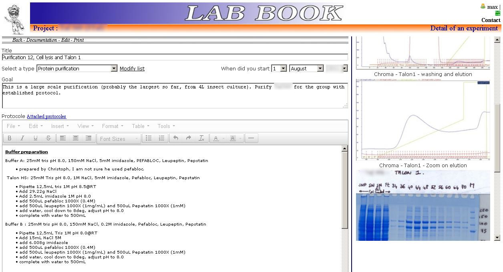
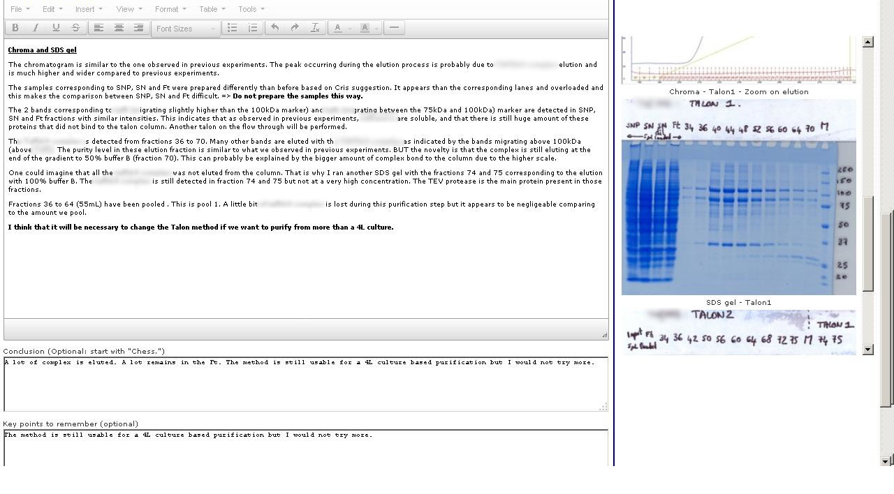
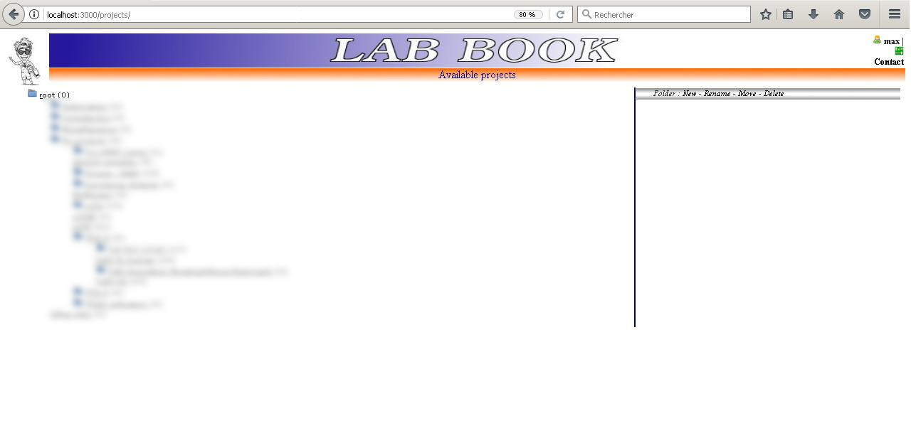
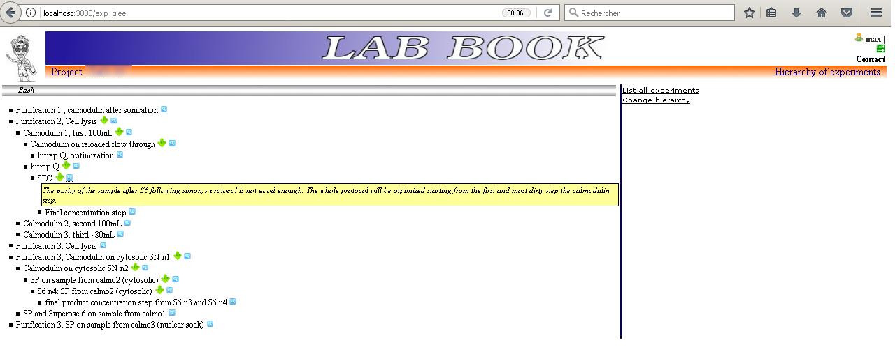
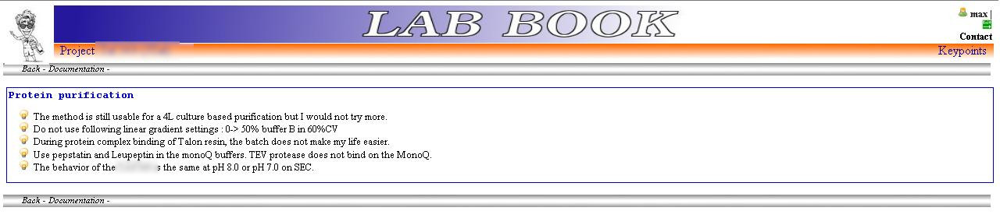

# Electronic labbook
As a scientist, you do experiments on the wet bench. Before starting the experiment for real, you need to prepare it, to think about it. This means do some bibliography, put your research activity into a scientific context, introduce the experiment, prepare a protocol. After the experiment, you need to write somewhere what you have done in details, collect and centralize the results (images, files, ..), interprete the data and finally conclude about what you have done.

All these steps used to be done with paper logbooks.

You can also do them with this electronic labbook.

I developped this project for my reseach activities and it was used daily. For security reasons, it was running on a micro USB disk.

# Features
- Organize your research experiments into projects.
- Manage your experiments
- Upload experimental data files and associate them to your experiment.
- Manage bibliography associated to your project
- Project history at a glance
- Experimental keypoints at a glance
- Manage your protocols

# Screenshots
Edition of an experiment
   

Projects view

Project history

Experimental keypoints

# Installation
This project is based on ruby on rails. MySQL database is used behind the scene. It is not compatible anymore with latest rails versions. I am considering reviving it. Feel Free to contact me if you are interested.

I was running the logbook on a USB pocket hard drive.

**Tags**
- ELN
- electronic logbook
- electronic lab notebook
